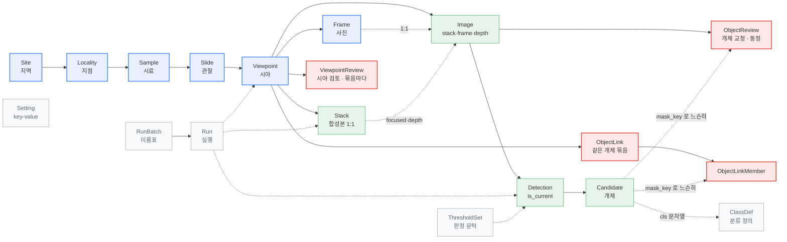
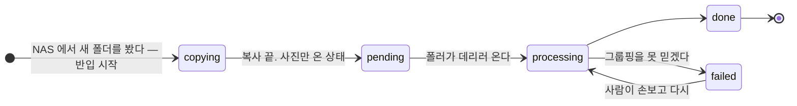
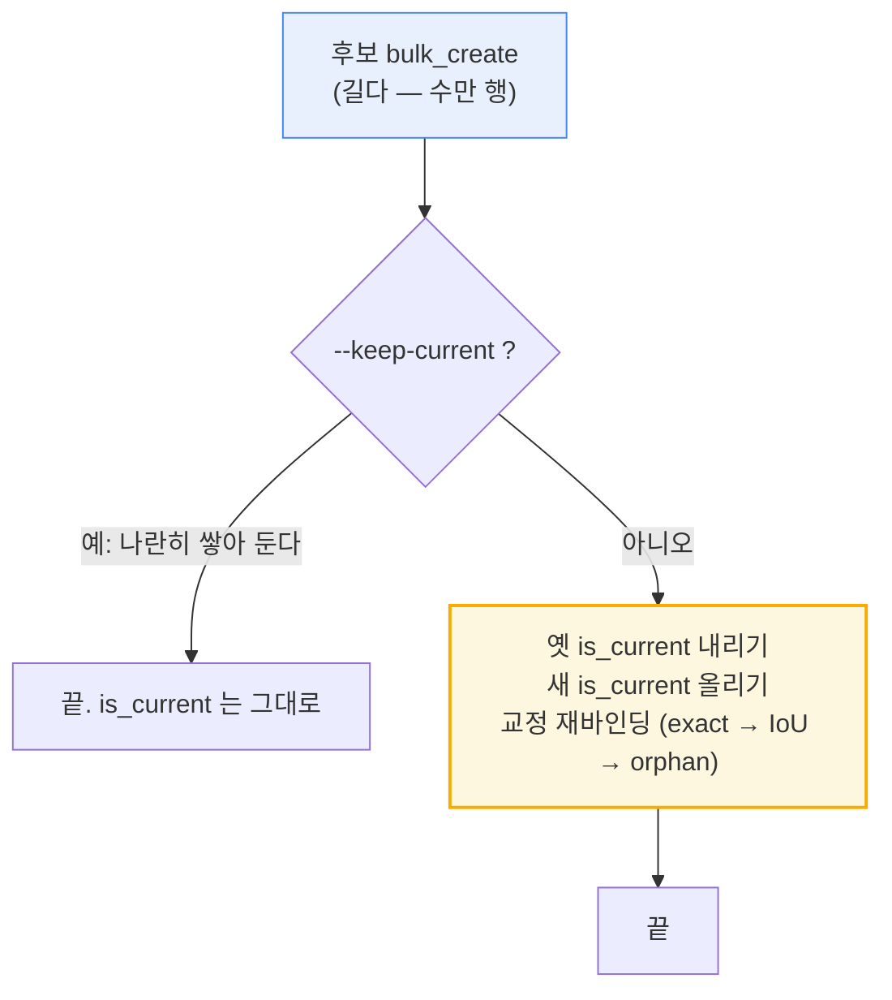

# DiaRUGA DB 명세

**2026-08-10** (`Image` 2026-08-05 — P06 · 층 개편 2026-08-06 — 063 ·
묶음 선택 2026-08-08 — P10 · **같은 개체 묶음 2026-08-09 — P11** ·
**개체 카탈로그 2026-08-10 — 105**)

규조류 분석 파이프라인이 쓰는 데이터베이스의 명세다. 남극 시추코어에서
시작했고 육상 노두(북평분지)가 들어와 있다. 테이블 하나하나가
무엇을 담는지, 서로 어떻게 매이는지, 그리고 **왜 그렇게 두었는지**를 적는다.

> **원본은 `web/viewer/models.py` 다.** 이 문서는 그것을 읽기 좋게 편 것이고,
> 둘이 어긋나면 코드가 맞다. 설계 근거는 `devlog/20260730_P02_db-schema.md`.

---

## 1. 물리 구성

| | |
|---|---|
| 엔진 | SQLite 3 (Django 5.2 ORM) |
| 파일 | `/srv/DiaRUGA/db/DiaRUGA.db` — 로컬 ext4 |
| 저널 | **WAL** (`journal_mode=WAL`, `synchronous=NORMAL`) |
| 외래키 | `PRAGMA foreign_keys=ON` |
| 잠금 대기 | `timeout=20` (초) |
| 페이지 | 4 096 B |
| 크기 | 108.6 MB (2026-08-10 기준) |

### 왜 SQLite 인가

읽는 쪽이 대부분이고, 쓰는 쪽은 사람의 교정과 파이프라인 둘뿐이다. 서버 프로세스가
하나 더 늘지 않는 것이 배포·백업 양쪽에서 이득이 크다.

**대신 쓰기는 한 번에 하나다.** WAL 이라 읽기는 여럿이 동시에 되지만 쓰기는
직렬화된다. 실제로 파이프라인이 도는 중에 사람이 검토를 저장하다가 `database is
locked` 로 **프레임 229장이 날아간 적이 있다.** 그래서 지금은

- 검출 저장을 **두 트랜잭션으로 나눈다** — 후보를 넣는 긴 부분과, `is_current` 를
  옮기고 교정을 다시 매는 짧고 원자적이어야 하는 부분
- 잠금 오류에만 재시도를 건다 (`with_db_retry`, 6회 지수 백오프)

"파이프라인이 도는 동안 사람이 검토한다" 가 일상이 되면 이 선택을 다시 봐야 한다.

### 파일이 아니라 디렉토리째 마운트한다

컨테이너에 `DiaRUGA.db` **파일 하나만** 물리면 WAL 이 만드는 `-wal`·`-shm` 형제가
컨테이너 안쪽에 생겨 호스트와 WAL 을 공유하지 못한다. 같은 DB 를 보는 줄 알았는데
아닌 상태가 된다. 그래서 `/srv/DiaRUGA/db` 디렉토리를 통째로 물린다.

### 들어가는 문은 하나다

DB 를 만지는 일회성 스크립트는 **전부 컨테이너 안에서** 돈다.

```bash
deploy/host/dbsync.sh check_db.py     # 저장소 → /srv/DiaRUGA/scripts
deploy/host/dbrun.sh  check_db.py     # 컨테이너 안에서 돈다
```

호스트 venv 로도 같은 파일을 열 수 있지만 그러면 **환경이 두 벌**이 된다. 그것으로
두 번 당했다 — 컨테이너의 낡은 `models.py` 가 새 칼럼을 몰라 NAS 반입이 죽었고,
root 로 돈 컨테이너가 파일 소유자를 바꿔 호스트 스크립트가 못 쓰게 됐다.
컨테이너는 `1000:1000` 으로 돌고, 시간대는 `TZ=Asia/Seoul` 로 호스트와 맞춘다.

### 사본

`cp DiaRUGA.db` 는 **금지**다 — WAL 때문에 불완전한 사본이 나온다. `backup_db.py` 가
sqlite 백업 API 로 뜨고, 검증을 통과한 뒤에야 제 이름을 준다(뜨는 중에는 `.part`).

| 어디 | 무엇 | 로테이션 |
|---|---|---|
| `backup/` | 시간별 자동 | 24시간 rolling, NAS 로 간다 |
| `backup/manual/` | 사람이 `--note` 로 뜬 것 | 안 걷는다 — 일 끝나면 사람이 지운다 |
| `backup/pre_deploy/` | 배포 직전 | 최근 20개 |

---

## 2. 전체 그림



**파랑**이 줄기(시료 계통), **초록**이 검출, **빨강**이 사람의 교정, **회색**이
설정과 이력이다. 실선은 소유(FK — 지우면 따라 지워진다), 점선은 참조이거나 FK 가
아예 아닌 것이다.

**빨강이 넷이다.** 교정(`ObjectReview`) · 시야 검토(`ViewpointReview`) ·
**같은 개체 묶음**(`ObjectLink`·`ObjectLinkMember`). 넷 다 사람이 만든 것이라
재생성 불가이고, 마스크를 FK 가 아니라 `(image, batch, mask_key)` 로 짚는다.

**검출과 교정은 `Image` 에 붙는다** (P06 · devlog 055). `Image` 는 **검출을 돌릴 수
있는 이미지 한 장**이고 `kind` 가 `stack | frame | depth` 다. 예전에는 `Detection` 이
`target`(`stack|frame`) + nullable `frame` 으로 다형 연관을 흉내 냈다 — 합성본이
`Frame` 이 아니라 테이블이 둘이었기 때문이다.

굵은 줄기는 **지역 → 지점 → 시료 → 관찰 → 시야 → 사진**이다. 폴더 이름
`RS23-GC03 71cm` 을 통짜 문자열로 두지 않고 갈라 담은 결과이고, 그래야 "같은
지점에서 위치에 따른 군집 변화" 나 "지역별 차이" 를 질의할 수 있다.

**시료 층은 2026-08-06 에 생겼다** (devlog 063). 그전에는 `Slide` 하나가 시료와
관찰을 겸해서 소속(`core`·`depth_cm`·`sample_kind`)이 **관찰 행마다** 앉아 있었고,
그래서 **같은 시료의 관찰 둘이 서로 다른 소속을 가질 수 있었다** — 실제로 한
관찰이 아무 데도 안 붙어 화면에서 통째로 사라졌다. 시료 행이 있으면 관찰은 그것을
가리키기만 하므로 어긋날 수가 없다.

```
권역   한국 · 남극                       Site.area
 └ 지역   BP(북평분지) · RS23            Site
    └ 지점   BP09(노두) · GC03(시추코어)  Locality   ← 예전 이름이 Core 였다
       └ 시료   0901 · 71cm              Sample
          └ 관찰   (1) · (2)             Slide
```

**"코어" 라고 부르지 않는다** — 노두는 시추한 것이 아니다. 어느 쪽인지는
`Locality.kind` 가 말하고 그것은 **지점의 성질**이다.

관계 하나하나(방향·필수 여부·`on_delete`)는 [ERD 문서](20260810_db-erd.md)에 있다.

---

## 3. 테이블별 명세

### 3.1 시료 계통

#### `Site` — 채취 지역

폴더명의 앞 토막(`RS23`, `WAP13`).

| 칸 | 형 | 비고 |
|---|---|---|
| `code` | char(32) **unique** | `RS23` |
| `name` | char(200) | 정식 명칭 — **사람이 채운다** |
| `area` | char(8) choices | `kr` 한국 / `ant` 남극. 기본 `ant`, **`db_default` 도 함께** |
| `region` | char(200) | 로스해 · 웨델해 … |
| `lat` / `lon` | float | |
| `note` | text | |

- **코드만으로 이름을 단정하지 않는다.** `RS` 가 Ross Sea 일 가능성이 크지만
  사람이 확인해 채운다.
- **`area` 와 `region` 은 다른 칸이다.** `region` 은 이미 세부 지명으로 차 있어
  목록을 가르는 상위 칸을 겸할 수 없다.
- **`db_default` 를 함께 주는 이유:** `default` 는 파이썬 쪽이라 그 모델을 아는
  코드에만 붙는다. 이 DB 는 뷰어 이미지와 파이프라인 이미지가 함께 쓰는데 판이
  따로 돌아서, 파이프라인이 옛 코드일 때 `Site` 를 만들면 이 칸을 안 보내고
  `NOT NULL constraint failed` 로 죽는다 — 실제로 NAS 반입이 그렇게 막혔다.

#### `Locality` — 지점 (시추코어 하나 또는 노두 하나)

**예전 이름이 `Core` 였다** (2026-08-06 개편, devlog 063). 육상 노두가 들어오면서
"코어" 가 안 맞았다 — 노두는 시추한 것이 아니다. `(site, code)` 가 unique.

| 칸 | 형 | 비고 |
|---|---|---|
| `code` | char(32) | `GC03` · `BP09` |
| `kind` | char(12) | **`core` \| `outcrop`.** 지점의 성질이다 — 한 지점이 둘일 수 없다 |
| `collect_kind` | char(64) | 채취 방식(`gravity core`). **사람이 적는 자유 문자열** — 예전 `Core.kind` 가 이것이다 |
| `lat` / `lon` / `water_depth_m` / `collected_at` / `note` | | 사람이 채운다. **코어는 KPDC 가 빈 칸만 채운다** (197 — `collect_kind` 도) |
| `kpdc_id` | char(32), `db_default ""` | KPDC Entry ID (`KOPRI-KPDC-00001836`). DOI 는 `10.22663/<id>`. `viewer/kpdc.py` 가 채운다 (`0044`, 197) |
| `kpdc_meta` | JSON, null | KPDC 페이지에 노출된 것 전부 — 제목·요약·담당자·좌표·첨부 목록·판 이력. 다시 긁으면 갈아치운다 |

**`kind` 와 `collect_kind` 를 가른 이유**: 앞은 화면이 갈래를 짓는 두 값이고
(노두면 깊이 축을 안 그리고 `OC` 를 찍는다) 뒤는 사람이 아무 말이나 적는 칸이다.
한 칸에 두면 화면이 문자열을 뜯어봐야 한다.

**유형이 `Slide` 가 아니라 여기 있는 이유**: 예전에는 `Slide.sample_kind` 로
관찰마다 따로 들고 있어서 **같은 지점의 관찰 둘이 다른 값을 가질 수 있었다.**

#### `Sample` — 시료 (지점에서 한 자리를 떠 온 것)

`(locality, code)` 가 unique.

| 칸 | 형 | 비고 |
|---|---|---|
| `code` | char(64) | 폴더에서 온 시료 코드. `71cm` · `0901`. **화면에 그대로 쓴다** |
| `depth_cm` | float null | **시추코어 지점에만.** 기준점에서의 깊이 |
| `sample_no` | uint null | **노두 지점에만.** 단면상의 위치 |
| `note` | text | |

**위치 칸이 둘이고 지점 유형에 따라 하나만 쓴다.** 한 칸에 몰지 않는 이유는
`depth_cm` 을 문자열로 안 바꾼 것과 같다 — "369cm" 와 "단면 9번" 을 같은 축에
그리게 된다. 지점은 코어이거나 노두이거나 둘 중 하나라 정렬할 때는 어차피 한
칸만 본다(`Sample.position` 이 고른다).

`sample_no` 는 사람이 부여한 숫자 코드에서 **지점 번호가 되풀이되는 자리를 뗀
것**이다 — `BP09` + `0901` → `1` (`naming.sample_no_from`).

#### `Slide` — 관찰 = 폴더 하나 = 슬라이드글라스 하나

**이 표는 관찰만 담는다.** 시료가 어느 지점의 무엇인가는 `Sample` 이 안다.

| 칸 | 형 | 비고 |
|---|---|---|
| `name` / `slug` | char | `slug` unique — URL 에 쓴다 |
| `image_dir` | char(500) | `DATA_ROOT` 기준 상대경로 |
| `sample` | FK null **SET_NULL** | 폴더 이름이 규칙을 안 따르면 안 붙는다. **지우면 예외가 안 나고 조용히 소속을 잃는다** |
| `obs_no` / `obs_label` | uint / char(10) | 관찰 번호(폴더 접미사에서 자동) · 이름표(사람) |
| `hide_in_list` / `exclude_from_totals` | bool | 사람이 고른다 |
| `description` | text | 사람이 적는다 — `state_note` 와 갈라 둔다 |
| `um_per_pixel_override` | float | 사람이 박는 배율 |
| `corr_thresh` | float | 그룹핑 상관 문턱 |
| `state` | char(12) | 아래 상태기계 |
| `state_note` | text | **자동 처리가 덮어쓴다** |
| `discovered_at` / `copied_at` / `processed_at` | datetime | NAS 반입 이력 |
| `created_at` / `updated_at` | datetime | 이 칸이 생기기 전 행은 `updated_at` 이 비어 있다 |

**지름길 property 가 넷 있다** — `slide.locality` · `slide.site` ·
`slide.depth_cm` · `slide.sample_kind`. 시료를 거쳐 가고, **소속이 없는 관찰에서
터지지 않게 한 겹 막아 두었다.** 질의에는 `sample__locality__site` 로 조인한다.

**이름을 `Observation` 으로 안 바꿨다** — 슬라이드글라스라는 물건이 실재하고 폴더
하나가 그것 하나다. 관찰은 그 위에 얹힌 뜻이지 다른 물건이 아니다.

**배율을 사람이 박을 수 있게 둔 이유:** ZEN 이 소프트웨어에서 선택된 대물렌즈를
적어서 실제와 어긋난 적이 있다(260731 이 100x 로 기록돼 µm/px 가 2.5배 작았다).
비어 있으면 40x 로 가정해 계산한다 — 40x · 1.6x 옵토바 · 0.63x 어댑터 = 0.1126.

#### `Viewpoint` — 시야

`(slide, idx)` unique. `idx` 가 URL 의 `g0`, `tag` 는 `g000_Snap-21365-21370`.
`n_frames` · `span_sec` · `sharpest_frame` · `grouping_run`.

> **`Group` 이라 부르지 않는다** — SQL 과 Django 양쪽에서 뜻이 겹친다.

#### `Frame` — 사진 한 장

`(slide, name)` unique. **슬라이드를 넘으면 이름이 겹친다** — 실제로 143개가
겹쳐 있었고, 슬라이드를 안 보고 이름만으로 찾다가 12개 시야가 엉뚱한 슬라이드로
붙어 파이프라인이 1분마다 헛돌았다.

`path` · `width`/`height` · `um_per_pixel`(+ `_source`: xml/sidecar/default/cli) ·
`acquired_at` · `sharpness` · `is_sharpest` · `seq` · `meta`(JSON) ·
`created_at`/`updated_at`.

- **`acquired_at` 과 `created_at` 은 다르다.** 앞은 촬영 시각(딸린 XML 이 알려
  준다), 뒤는 우리 시스템이 받은 때다.
- 광학계 정보는 전 사진 동일하고 지금 쓰는 곳이 없어 칼럼 대신 `meta` 에 담는다.

#### `Stack` — all-in-focus 합성본 (`Viewpoint` 와 1:1)

`focused_path` · `depth_path` · `depth_npz_path` · `um_per_pixel`(+ native,
`resize_scale`) · `ref_frame` · `align_failed` · `object_px_frac` ·
`sharpness_best_single` / `sharpness_fused` / `gain` · `run`.

합성 전후 선명도를 함께 들고 있어 **합성이 실제로 이득이었는지**를 사후에 따질 수 있다.

#### `Image` — 검출을 돌릴 수 있는 이미지 한 장

**열쇠는 `path` 다** (`DATA_ROOT` 기준 상대경로, `unique`). 파일 하나에 행 하나이고
실측 2,664개 — 프레임 1,830 + 합성본 417 + 깊이맵 417.

| 칸 | 비고 |
|---|---|
| `path` | **unique. 자연 열쇠** |
| `kind` | `stack` / `frame` / `depth` |
| `viewpoint` | FK **`SET_NULL`** — 그룹핑 전 프레임은 비어 있다 |
| `frame` | 1:1 FK `SET_NULL` — 촬영본이면 그 프레임 |
| `stack` | FK **`CASCADE`** — 합성본·깊이맵이면 그 `Stack` |
| `width` · `height` | |

**두 `on_delete` 의 방향이 반대인 것이 요점이다.** 시야 가르기
(`regroup.apply_split`)는 시야를 지우고 다시 만드는데 —

- **프레임은 원본 사진이라 살아남아** 다른 시야로 묶인다 → `viewpoint` 는 `SET_NULL`
- **합성본·깊이맵은 그 묶음에서 나온 것이라 무효다**(서로 다른 시야가 된 프레임들을
  합쳐 놓은 그림이다) → `stack` 이 `CASCADE`

**촬영·합성 메타는 `Frame`·`Stack` 에 그대로 있다.** 이 테이블은 정체만 맡는다.
만드는 문은 `web/viewer/images.py` 하나이고 파이프라인 네 자리와 `regroup` 이
전부 거기를 지난다.

### 3.2 검출

#### `Detection` — 이미지 한 장에 대한 검출 실행

| 칸 | 비고 |
|---|---|
| `viewpoint` | FK cascade |
| `image` | **FK cascade, NOT NULL** — 무엇에 붙은 검출인가는 `image.kind` 가 말한다 |
| `image_path` · `width` · `height` · `scale` | `image_path` 는 `image.path` 와 같다(옛 칸) |
| `um_per_pixel`(+ native, source, `backfilled`) | |
| `n_raw_masks` · `n_sized` | 원시 마스크 수, 크기 통과 수 |
| `thresholds` | FK `ThresholdSet` |
| `run` | FK `Run` |
| `is_current` | **뷰어가 볼 것** |
| `superseded_by` | self FK, `SET_NULL` |

**검출은 덮어쓰지 않고 쌓는다.** 재실행마다 새 행이 생기고 `is_current` 가 옮겨
간다. 엔진 교체 전후를 같은 시야에서 비교하려면 옛것이 남아 있어야 한다.

- 엔진마다 검출을 다는 자리가 다르다 — **SAM2 는 합성본 한 장에만**, **YOLO 는
  프레임마다 + 합성본에도** 단다. 그것이 `image.kind` 로 드러난다.
- **`kind="depth"` 에는 검출이 붙지 않는다.** 깊이맵은 Z 좌표가 없는 상대값이라
  검출 대상이 아니다 — 관행이 아니라 스키마에 적혀 있고
  `migrate/backfill_images.py --verify` 가 지킨다.
- `superseded_by` 가 `SET_NULL` 이라 옛 검출을 지워도 현재 검출이 딸려 가지 않는다.
- **같은 묶음 안에서 같은 이미지에 둘 이상 쌓인 것은 기록이 아니라 찌꺼기다**
  (빠진 프레임을 다시 돌리면 이미 끝난 것까지 다시 쌓인다). `prune_detections.py`
  가 현재 검출 → 없으면 번호가 큰 것 하나만 남기고 지운다. **묶음을 넘어서는
  지우지 않는다.**

#### `Candidate` — 개체 하나

`(detection, mask_key)` unique. 통과분과 탈락분을 **한 테이블에 담고 `passed` 로 가른다** —
문턱을 바꾸면 개체가 무리를 옮겨 다니는데, 칼럼 하나면 `refilter` 가 UPDATE 한 번이다.

| 갈래 | 칸 |
|---|---|
| 자리 | `bbox_x/y/w/h` · `center_x/y` · `mask_key`(bbox 로 만든 키) · `raw_id` |
| 크기 | `area_px` · `area_um2` · `major_um` · `minor_um` · `long_side_um` · `short_side_um` |
| 모양 | `aspect_ratio` · `fill_ratio` · `circularity` · `convexity` · `solidity` · `elongation` · `ellipse_iou` · `shape_ok` |
| 질감·신뢰 | `texture` · `predicted_iou` · `stability_score` |
| 기하 | `polygon` — `[x0,y0,x1,y1,…]` 평탄 배열 |
| 판정 | `passed` · `cls` · `reject` |

`polygon` 이 **용량의 대부분**이다 (26.8 MB / 108.6 MB ≈ 25 %). 마스크를 그리는
근거라 줄일 수 없다.

**`passed`·`cls`·`reject` 는 저장된 사실이 아니라 순수 함수의 캐시다.** 같은 지표와
같은 문턱이면 `judge.py` 가 언제나 같은 답을 낸다. `check_db.py` 가 그 셋을 다시
계산해 저장된 값과 맞는지 본다 — 어긋나면 문턱을 바꾸고 다시 안 걸렀다는 뜻이다.

### 3.3 사람의 교정 — **재생성 불가**

#### `ObjectReview` — 개체 단위 교정

**열쇠가 `(image, batch, mask_key)` 다.** 두 번 옮겼다.

- `(viewpoint, mask_key)` → `(image, mask_key)` (P06 5a) — 앞엣것은 **시야마다 볼
  이미지가 한 장**일 때만 성립한다. 프레임별 검출을 검토하면 깨진다(실측으로
  시야 452개 중 203개(45 %)에서 `mask_key` 가 프레임끼리 겹친다)
- `+ batch` (P09 5.1 · P10) — 같은 마스크라도 `sam2-전수` 를 보며 한 판단과
  `yolo-3차` 를 보며 한 판단은 **다른 줄**이다. 안 가르면 SAM2 시절 "오검출" 이
  YOLO 검출에 얹혀, 사람은 **자기가 지우지 않은 것이 지워져 있는 것**을 본다
  (실측 1,076건)

`batch=NULL` 은 **사람이 그린 마스크**다 — 어느 회차에도 속하지 않고
"이 이미지에 규조각이 있다" 는 사실이다(P09 5.2). SQLite 는 NULL 끼리 안
부딪힌다고 보므로 유일 제약을 **조건을 갈라 두 벌**로 적는다.

| 칸 | 비고 |
|---|---|
| `image` | **FK cascade, NOT NULL** — 어느 이미지를 보고 한 판단인가 |
| `batch` | **FK PROTECT, null** — 어느 검출을 보며 한 판단인가. `NULL` = 사람이 그린 것 |
| `viewpoint` | FK cascade — 편의용. 화면·목록이 시야로 묶어 본다 |
| `mask_key` | **개체를 가리키는 키** |
| `candidate` | FK null — **바인딩 결과일 뿐이다** |
| `bind_method` | `exact` / `iou` / `manual` / `orphan` |
| `bind_score` | IoU 로 붙었을 때의 값 |
| `geom` | `{"bbox": [x,y,w,h], "polygon": [...]}` |
| `geom_edited` | 사람이 경계를 고쳤다 (P09 4단계) |
| `source` | `engine` / `manual` — 그린 개체를 추린다 |
| `removed` · `accepted` | 지웠다 / 되살렸다 |
| `label` · `note` | 분류 지정 · 메모 |
| `species` | **동정** — 사람이 적는 종명 (105). 재생성 불가 |

**한 행이 두 가지를 겸하고 있다.** 모델 주석이 그 선을 그어 놨다:

| 칸 | 무엇에 대한 판단인가 | 속하는 곳 |
|---|---|---|
| `removed`·`accepted` | 그 batch 가 낸 그 마스크가 틀렸다/맞다 | **batch** |
| `label`·`note`·`species` | 이 규조각이 Eucampia 다 | **개체** — batch 를 갈아도 참이다 |

뜻은 갈라 놓고 자리는 한 행이라, 회차를 갈면 동정까지 함께 별개가 된다.
가르는 안이 `devlog/20260810_P12_object-and-judgement.md` 에 있다 — **아직
안 했다.**

**교정은 `Candidate` 가 아니라 `mask_key` 에 붙는다.** FK 로 매면 재검출에서
후보 행이 새로 생기므로 사람의 판단이 조인 실패로 사라진다. 실측으로 같은
설정이면 100 % 붙지만 엔진을 갈면 거의 0 이 된다 — 그래서 교정 행은 `geom` 에
기하를 스스로 들고 있어 **검출기와 독립적으로 읽힌다.**

**`removed` 와 `accepted` 를 한 칼럼으로 합치지 않는다.** 되살렸다가 다시 지운
개체가 있고, "사람이 지웠다가 이긴다" 는 규칙이 두 값의 조합으로 표현된다.

지운 것까지 전부 저장한다 — **학습의 어려운 음성 표본**이다.

#### `ViewpointReview` — 시야 단위 (묶음마다 한 줄)

`done` · `note`. **고칠 것이 없어 교정이 비어도 검토는 끝났을 수 있다**. 그래서
따로 남긴다.

**1:1 이 아니다** (073). "검토 완료" 는 *그 묶음의 검출을 다 봤다*는 말이라
`(viewpoint, batch)` 마다 한 줄이고, **시야 코멘트는 묶음을 갈아도 참**이라
`batch=NULL` 줄 하나에 따로 앉는다. 한 줄에 담아 뒀더니 `sam2-전수` 에서 붙인
완료가 `yolo-3차` 화면에도 붙어, 아직 아무도 안 본 검출이 "검토 완료" 로 보이고
"다음 미검토" 가 그 시야를 건너뛰었다.

#### `ObjectLink` / `ObjectLinkMember` — 같은 개체 묶음 (P11)

한 시야는 스테이지가 안 움직인 상태라 **초점면 3~5장에 같은 규조각이 서너 번**
잡힌다. 그것이 하나라는 것을 이 둘이 말한다. **사람이 프레임마다 골라 만든 것이라
재생성 불가**이고, `ObjectReview` 와 같은 규약을 따른다.

| 테이블 | 칸 | 비고 |
|---|---|---|
| `ObjectLink` | `viewpoint` · `batch` · `note` | 묶음 하나 = 규조각 하나 |
| `ObjectLinkMember` | `link` · `image` · `batch` · `mask_key` | "그 판에서는 이 마스크" |
| | `is_rep` | 대표 — 학습 자료로 뽑을 때, 목록에 보일 때의 얼굴 |
| | `geom` | 기하 스냅샷 — 검출기가 바뀌어도 읽힌다 |

**제약 넷이 이 테이블의 본체다** ([ERD §3](20260810_db-erd.md)) — `(link, image)`
하나 · `(image, batch, mask_key)` 하나(+ 그린 개체용 짝) · `is_rep` 는 묶음당 하나.

- **묶음은 시야를 못 넘는다** — 다른 시야는 스테이지가 움직인 뒤라 "같은 자리"
  라는 근거 자체가 없다
- **회차도 못 넘는다** — 같은 규조각이 두 회차에 잡혀 있어도 하나라고 말할 자리가
  없다. `YOLO 4차` 가 들어올 때 정한다 (TODOs · devlog 105 덧)
- **탈락 후보를 묶으면 되살아난다** (102) — 그 자리에서 `ObjectReview(accepted)`
  가 생긴다. *묶기가 판정을 만드는* 유일한 자리다
- **분류는 묶음을 따라 번진다** (104) — 한 판에서 정하면 나머지 멤버의
  `label` 에 같은 값이 앉는다. **동정(`species`)은 아직 안 번진다**
- 카탈로그는 묶음을 **그림에만** 쓴다 — 면적이 가장 큰 멤버로 카드 그림을 바꾸고
  **번호는 안 바꾼다**(논문·표에 적히는 값이다)

### 3.4 설정과 이력

#### `ThresholdSet` — 판정 문턱 11개

`min_um` · `max_um` · `texture_min` ·
`round_max_elong` · `round_min_iou` · `round_min_solidity` · `round_texture_min` ·
`rod_min_elong` · `rod_max_elong` · `rod_min_iou` · `rod_min_solidity`.

테이블로 두어 이름을 붙여 비교할 수 있다 — "1500 대 2000 을 같은 시야에 걸고 개수를
나란히". 원형은 areolae 를 더 무겁게 본다(`round_texture_min` 이 따로 있는 이유) —
형태만으로는 밋밋한 원반을 가려낼 수 없다.

#### `ClassDef` — 분류 정의

| 칸 | 무엇 | 비면 |
|---|---|---|
| `key` **unique** | `round` · `rod_frag` · `chaetoceros` | — |
| `label` | 전체 이름 | |
| `short` | 약칭. 자리가 좁은 곳에서 쓴다 | `label` 을 쓴다 |
| `badge` | 배지 CSS 클래스 | `base.html` 에 `.badge.<badge>` 규칙이 있어야 한다 |
| `color` | `"60,220,120"` | **마스크가 투명해진다** |
| `hotkey` | 검토 화면 단축키 | 그 분류만 메뉴로만 지정된다 |
| `counted` | 개체 수로 세는가 | |
| `is_taxon` | 형태가 아니라 분류학으로 알아본 것인가 | |
| `sort_order` · `active` | 차례, 켜고 끄기 | |

테이블로 두면 분류를 더할 때 배포가 필요 없다 — Eucampia 를 넣은 것이 코드 수정이었다.
형태 칸(원형·봉상)과 분류학 칸(`is_taxon`)은 성격이 달라 메뉴에서 줄을 그어 나눈다.

`counted` 는 **개체 수로 세는가**다. 파편은 개체가 아니다 — 깨진 조각 하나를 규조
한 개로 세면 밀도가 부풀고 그 숫자가 보고서에 실린다. 목록의 "검출" 칸은 이 값이
참인 분류만 더한 것이고, 미분류는 분류 자체가 없어 애초에 빠진다.

**하나라도 비면 예외는 안 나고 그 분류만 화면에서 조용히 다르게 굴러간다.**
Chaetoceros 를 넣으며 실제로 겪은 것들이라 `check_db.py` 의 4번 검사가 `hotkey` 와
`color` 가 빈 것을 잡는다.

**데이터가 어떻게 들어가는가**

행은 사람이 화면에서 만드는 것이 아니라 **코드가 넣는다.** 두 경로가 있고, 둘 다
`update_or_create(key=…)` 라 **몇 번 돌려도 같은 상태**가 된다.

| 언제 | 무엇 | 어디 |
|---|---|---|
| 처음 DB 를 세울 때 | 다섯 행 (원형·원형 파편·봉상·봉상 파편·Eucampia) | `migrate/import_json.py` 의 `CLASS_SEED` → `seed_settings()` |
| 그 뒤에 더하거나 고칠 때 | 마이그레이션 | `0013` `counted` · `0014` Chaetoceros · `0015` 파편 색 · `0016` `hotkey` · `0017` `short` |

**마이그레이션으로 넣는 이유는 배포마다 같은 상태가 되어야 하기 때문이다.** 손으로
INSERT 하면 운영 DB 에만 있고 새로 만든 DB(시험·복구)에는 없다. 되돌릴 때는 행을
지우지 않고 `active=False` 로 끈다 — 지운 뒤에 그 분류로 붙인 교정이 남아 있으면
화면에서 이름도 색도 없는 분류가 된다.

읽는 쪽은 `data.py` 가 `active=True` 인 것만 가져와 **프로세스 수명 동안 캐시**한다
(거의 안 바뀌는데 템플릿과 클라이언트가 여러 번 묻는다). 테이블을 고치면
`invalidate_classes()` 로 버린다.

`color` 는 테이블에 적혀 있지만 **화면의 색은 아직 CSS 가 키로 잡는다.** 그래서 분류를
하나 더하거나 색을 바꾸면 이 행만으로 끝나지 않고 `base.html` 도 함께 가야 한다 —
테이블로 옮기다 만 자리이고, 기계로도 아직 못 본다. `0015` 가 파편을 제 본체와 같은
색 가족으로 묶은 것(진하기로만 가른다)도 테이블과 CSS 양쪽을 고친 작업이다.

#### `Run` / `RunBatch` — 실행 이력

`Run`: `kind`(group/stack/detect/refilter/reconcile/ingest/export) ·
`status`(running/**partial**/done/failed) · `params`(JSON) · `counts`(JSON) ·
`host` · `gpu` · `code_version` · `error`.

- **`partial` 이 따로 있는 이유:** GPU 를 다른 작업이 침범해 9장이 조용히 빠졌는데
  실행은 `done` 이었다. 나중에 프레임 수를 세어 보고서야 알았다.
- **`RunBatch` 는 실행이 아니라 이름표다.** 파이프라인은 슬라이드 단위로 도는데
  ("전체를 한 번 훑었다" 는 작업이 실행 여럿으로 흩어진다) 엔진을 비교하려면 그
  한 번을 한 덩어리로 봐야 한다. 부모 `Run` 을 두지 않은 것은 그쪽이 자기
  `started_at`·`counts` 를 갖게 되어 뜻이 겹치기 때문이다. `(kind, label)` unique.
- **`for_review` 가 뷰어가 볼 묶음을 정한다** (P10). 참인 것은 **하나뿐**이고
  DB 가 막는다 — 둘이면 화면마다 다른 판을 보게 되고, 그 상태에서 한 검토가
  051 을 냈다. 관리 화면에서 고른다.
- **`code` 는 카탈로그 번호의 꼬리다** (105) — `S1`·`Y3`. 빈 것 말고는 유일하고,
  `M`·`m` 은 **사람이 그린 개체 몫**이라 회차가 못 가져간다(CheckConstraint).

#### `Setting` — 그 밖의 설정

`key` unique · `value`(JSON). 경로처럼 **배포마다 다른 값은 여기 두지 않는다**
(환경변수). 지금은 `upright_min_ratio` · `crops_per_page` 둘.

---

## 4. 반드시 지켜지는 것 (`check_db.py` 가 보는 것)

`deploy/host/dbrun.sh check_db.py` — 1초. `refilter`·`segment` 뒤, `judge.py` 를 고친 뒤,
숫자가 이상할 때 돌린다.

| # | 불변식 | 깨지면 |
|---|---|---|
| 1 | `passed`·`cls`·`reject` 가 `judge.py` 를 다시 돌린 값과 같다 | 문턱을 바꾸고 다시 안 걸렀다 |
| 2 | **이미지마다** 뷰어가 볼 검출이 하나 이하 (P10 — `is_current` + `for_review`) | 둘이면 어느 것을 보일지 모르고, 없으면 검출이 사라진 것처럼 보인다 |
| 3 | 교정이 현재 검출의 개체를 가리킨다 (`bind_method` 분포) | 재검출에서 교정이 떨어져 나갔다 |
| 4 | 붙어 있는 `cls`·`label` 이 전부 `ClassDef` 에 있고, 활성 분류에 `hotkey`·`color` 가 있다 | 이름도 색도 없이 나오거나, 마스크가 투명해지거나, 그 분류만 메뉴로만 지정된다 |
| 5 | 경로가 실제 파일을 가리키고 배율이 있다 | 사진이 안 뜬다 |
| 6 | **층이 앞뒤가 맞는다** — 지역 → 지점 → 시료 → 관찰 (P07) | 소속을 잃은 행은 500 도 404 도 아니고 **화면에서 그냥 사라진다** |
| 7 | **같은 개체 묶음이 앞뒤가 맞는다** (P11) | 대표가 0개인 묶음, 멤버가 하나뿐인 묶음 |
| 8 | **카탈로그 번호가 날 수 있고 겹치지 않는다** (105) | 번호가 안 나오거나 두 개체가 같은 번호를 받는다 |
| 9 | 문턱이 **슬라이드 안에서 하나** | 같은 슬라이드의 시야끼리 개수를 못 견준다 |

**예외가 나지 않고 그냥 틀린 상태**를 잡는 것이 목적이다.

---

## 5. 상태기계

### `Slide.state`



반입을 시작하면 `copying`, **복사가 끝나면 `pending`**(사진만 왔고 시야는 아직
없다 — 시야 0 이 정상이다), 파이프라인이 도는 동안 `processing`, 끝나면 `done`.
`pending` 이 오래 남아 있으면 폴러가 안 도는 것이고, 그것을 보는 자리가
**시스템 설정 · 파이프라인 탭**이다(098). **그룹핑 신뢰도가 낮으면 자동으로 넘기지 않고**
`failed` + `state_note` 로 사람을 부른다.

`processing` 인 동안 검토 저장은 서버가 거절한다 — 반쯤 처리된 슬라이드를 검토하면
아직 안 돌아간 시야의 검출이 뒤늦게 들어오면서 이미 본 화면이 바뀐다.

### `Detection.is_current`



**파랑이 첫 트랜잭션, 주황이 두 번째다.**

가운데가 끊기면 뷰어가 "교정이 붙지 않은 새 검출" 을 보여준다. 그래서 그 부분은
반드시 한 덩어리다. `--keep-current` 를 주면 첫 트랜잭션만 하고 끝낸다 — 다른
엔진의 결과를 나란히 쌓아 두는 길이다.

---

## 6. 지금 담긴 것 (2026-08-10)

| 테이블 | 행 |
|---|---|
| `Site` / `Locality` / `Sample` / `Slide` | 5 / 5 / 10 / 12 |
| `Viewpoint` / `Frame` / `Stack` | 570 / 1,830 / 417 |
| `Image` | **2,664** (프레임 1,830 · 합성본 417 · 깊이맵 417) |
| `Detection` / `Candidate` | 2,817 / 122,333 (통과 32,480) |
| `ObjectReview` / `ViewpointReview` | **7,914** / 521 (완료 311 · 코멘트 6) |
| **`ObjectLink` / `ObjectLinkMember`** | **4 / 12** |
| `Run` / `RunBatch` | 213 / 2 |
| `ThresholdSet` / `ClassDef` / `Setting` | 2 / 6 / 2 |

**지점 5곳 · 시료 10개** — 시추코어 4곳(RS23-GC03 · WAP13-GC47 · AM22-GC10B ·
GC03-C1)과 **노두 1곳**(BP-BP09).

**교정 7,914건의 속내** — 삭제 6,120 · 되살림 863 · 분류 지정 1,774 · 메모 2 ·
**사람이 그린 개체 171** · 사람이 고친 기하 4 · **동정 0**(카탈로그를 막 열었다).
바인딩은 전부 `exact`.

**실행 213건** — detect 136 · ingest 31 · stack 19 · group 14 · refilter 6 ·
reconcile 5 · export 2.

**묶음 둘** — `sam2-전수`(`S1`) · **`yolo-3차`(`Y3`, 지금 검토 대상)**.
`yolo-1차`·`2차` 는 046 에서 걷었다.

**분류 여섯** — 원형 · 원형 파편 · 봉상 · 봉상 파편 · Eucampia · Chaetoceros
(뒤의 둘이 `is_taxon`, 파편 둘이 `counted=False`).

**같은 개체 묶음 4개 · 멤버 12** — 손으로 만들기 시작한 참이다. 멤버 12건 중
3건은 교정 행 없이 묶기만 한 마스크이고 그것이 정상이다.

> 이 교정은 사람이 시야를 하나씩 검토해 만든 것이고 **다시 만들 수 없다.**
> `stacked/`·`out/` 은 다시 돌리면 나오고 원본 사진은 NAS 에 있지만, 이것만은
> 아니다. 큰 작업 전에는 반드시 `ops/backup_db.py` 로 사본을 뜬다.

---

## 7. 마이그레이션

`web/viewer/migrations/` 에 0001 … **0031**. **전부 걸려 있다** (2026-08-10,
`v0.10.0` 배포 때). 컨테이너가 뜨면서 `migrate` 가 돈다.

최근 것들:

| 판 | 무엇 |
|---|---|
| `0019`~`0022` | `Image` 도입과 조이기 (P06 · 055) |
| `0023`~`0028` | 층 개편(`Locality`·`Sample`, 063) · 교정 열쇠에 `batch`(P09) · 묶음 선택(P10) |
| `0029` | `RunBatch.recipe` |
| **`0030`** | **`ObjectLink`·`ObjectLinkMember` 테이블 둘** (P11). 있는 테이블을 안 건드려 파이프라인 이미지를 함께 안 올려도 됐다 |
| **`0031`** | **`ObjectReview.species` · `RunBatch.code`** + 제약 둘 (105) |

**`0022` 는 되돌릴 수 없다.** 0019~0021 은 옛 칸을 그대로 두고 곁들이기만 해서
판을 되돌리면 옛 코드가 그대로 돌았다.

**`0022` 는 되돌릴 수 없다.** 0019~0021 은 옛 칸을 그대로 두고 곁들이기만 해서
판을 되돌리면 옛 코드가 그대로 돌았다.

**스키마를 조이는 마이그레이션은 뷰어와 파이프라인 판을 함께 올린다.** 칼럼을
걷었는데 옛 파이프라인 이미지가 거기에 INSERT 하면 폴러가 멈춘다 — 실제로
`v0.2.1` 이 `target=` 을 써서 죽었고, **조인 사본에 파이프라인 컨테이너를 붙여
돌려 보고** 잡았다(055).

**여기서 조심할 것이 하나 있다.** 작업 트리의 `models.py` 는 새 칸을 아는데 DB 는
아직 모르는 상태가 **정상적으로 존재한다** — 코드를 커밋한 때와 그것을 담은
이미지를 배포한 때 사이다. 그 사이에 호스트에서 작업 트리 코드로 DB 를 물으면
`no such column` 으로 죽는다. 실제로 이 문서를 쓰다가 그렇게 죽었다(그때 DB 는
0012, 작업 트리는 0014 였다).

`dbrun.sh` 로 물으면 배포된 코드와 배포된 스키마가 함께 움직이므로 이 어긋남이
생기지 않는다. §1 의 "들어가는 문은 하나다" 가 이것을 막는다.

## 8. 아직 빈 곳

- **`ObjectReview.viewpoint` 는 이제 편의용이다.** 진짜 열쇠는
  `(image, batch, mask_key)` 이고, 둘이 어긋나면 안 된다 —
  `migrate/backfill_images.py --verify` 가 본다
- **`species` 가 아직 비어 있다** — 카탈로그를 막 열었다(105). 동정이 쌓이기
  시작하면 그때 무게가 드러난다
- **개체와 판정을 가르는 안이 서 있다** — `ObjectReview` 한 행이 마스크 판정과
  개체 판단을 겸하고 있다. `devlog/20260810_P12_object-and-judgement.md`.
  **아직 안 했다** — `YOLO 4차` 가 들어올 때 함께 정한다
- **묶음이 회차를 못 넘는다** (TODOs · 105 덧) — 같은 규조각이 두 회차에 잡혀
  있어도 하나라고 말할 자리가 없다
- `migrate/import_json.py` 는 **멱등이지만 `Candidate` 를 지우고 다시 만든다.** DB 에서만
  한 교정이 있는데 옛 JSON 을 넣으면 JSON 쪽으로 되돌아간다 — 아무 때나 돌리지 않는다
- `ObjectReview.bind_method` 가 전부 `exact` 다. IoU 바인딩은 코드에 있지만 아직
  실전에서 쓰인 적이 없다 — 엔진을 갈아 끼우는 날 처음 시험대에 오른다
