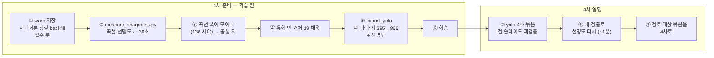

# 개체마다 판의 선명도를 잰다 — 계획 정리 보고서

**작성일** 2026-09-11
**저장소** `github.com:koprifossillab/DiaRUGA`
**근거** 계획 문서 [P26](../devlog/20260910_P26_object-plane-sharpness.md)
(2026-09-10 작성 · 09-11 12·15절 추가) · `TODOs.md`
**상태** **계획 단계 — 검토가 더 필요하다.** 실행은 YOLO 4차와 함께 간다.
곁가지 하나(유형 일괄 채우기)만 09-10 에 실행했고, 09-11 에 백업 사본으로
측정을 한 바퀴 돌려 정할 것 여섯 중 다섯을 닫았다.

이 문서는 P26 의 계획·실측·결정을 **지금 시점에서 한 벌로 정리한 것**이다.
판단의 근거와 버린 안은 P26 본문에 있고, 여기서는 **무엇을 하려 하고 무엇이
정해졌고 무엇이 남았는지**를 본다.

---

## 1. 요청과 물음

사용자 요청 (2026-09-10): *"개체 1개에 할당된 여러 개의 이미지에서 그 이미지
영역만을 평가"*, 그리고 **그 값을 무엇으로 쓸 것인가.**

| 물음 | 답 |
|---|---|
| 무엇을 재나 | **(개체, 그 개체의 멤버 판) 쌍마다 선명도 값 하나** |
| 어느 판을 | **그 개체에 할당된 이미지들** — 시야의 모든 판이 아니다 |
| 어느 영역에서 | 그 멤버가 **자기 이미지에 들고 있는 폴리곤 안** |
| 합성본도 재나 | **잰다** — "합성본이 늘 이긴다" 는 가정이지 정의가 아니다 |
| 무엇으로 쓰나 | **판을 고르는 자가 아니라 모습이 놓이는 축** (3절) |
| 언제 하나 | **YOLO 4차 한 바퀴에 묶는다** (7절) |

**범위를 좁힌 것이 첫 요점이다.** 처음 판은 *"그 개체가 있는 시야의 모든 판"*
으로 잡았다가 (개체 × 판) 24,853 쌍이 되었고 그중 판정이 있는 자리가 30.5%
뿐이라, 남의 판에서 폴리곤을 빌리고 프레임끼리 정렬을 맞추는 문제가 계획의
절반을 먹었다. **개체에 할당된 이미지로 좁히면 그 문제가 통째로 없어진다** —
멤버마다 자기 이미지의 좌표로 폴리곤을 이미 들고 있다.

### 1.1 말

| 말 | 뜻 |
|---|---|
| **시야** | 한 자리에서 초점을 달리해 찍은 사진 묶음 (프레임 여러 장 + 합성본 한 장) |
| **판** | 검출을 돌릴 수 있는 이미지 한 장 — 프레임이거나 합성본 (`Image`) |
| **개체** | 사람이 "같은 규조각" 이라고 묶은 것 (`DiatomObject`) |
| **멤버** | 개체가 어느 판에서 어떤 폴리곤으로 보이는가 — 판마다 한 행 (`ObjectReview`) |
| **대표** | 개체를 보여줄 때 쓰는 판. 사람이 고른다 (`is_rep`) |

---

## 2. 왜 지금인가

**① "어느 판이 좋은가" 를 지금은 사람만 말한다.** 대표(`is_rep`)는 사람이
고르고, 사람이 안 고른 개체의 얼굴은 기계의 물러나는 규칙 — *합성본이 있으면
합성본, 없으면 가장 큰 판* — 위에 서 있다. **그 규칙은 실측된 적이 없었다.**

**② YOLO 4차가 판을 다 내보내는 쪽으로 간다.** 지금 `export_yolo` 는 시야마다
판 한 장만 낸다. 판마다 라벨을 내면 295 시야 → 866 판이 되는데, 그 라벨 폴리곤은
**합성본 위에서** 만든 것이라 흐린 판에 그대로 옮겨 붙는다. 3차 성적에서
"싱글턴/합성본 차이가 모델 탓인지 라벨 탓인지" 가 열려 있었다(025 §9).

**③ 사람이 볼 자리가 이미 있다.** 크롭은 판마다 이미 굽고 있고, 오프라인
검토기·카탈로그가 개체마다 판 목록을 만든다. 자르는 쪽은 준비돼 있고 **차례를
정할 값**이 없을 뿐이다.

---

## 3. 방침 — 선명도는 판을 고르는 자가 아니라 **모습이 놓이는 축**이다

**사용자 방침 (2026-09-10).**

> 개체 하나가 판 셋을 갖고 선명도가 80% · 60% · 30% 라면, 그 셋은 **이 유형이
> 80%일 때 · 60%일 때 · 30%일 때의 모습**이다. 80% 가 대개 그 개체를 가장 잘
> 나타내겠지만, 60% 와 30% 의 모습으로도 어느 정도 유추할 수 있다. 규조마다
> 선명도에 따라 다른 형태로 보일 수 있어서 이렇게 걸어 둔다.
> (묶는 단위는 지금은 **유형**이고, 종 동정이 잘 되면 그때는 **개체**다.)

따라 나오는 것 셋:

1. **흐린 판은 나쁜 표본이 아니라 다른 모습이다.** 현미경 앞에서 마주치는 것도
   대개 80% 짜리가 아니다.
2. **거르는 것이 아니라 가중치다.** 문턱이 아니다 — 등급으로 거르지 않기로 한
   것(09-04)과 같은 줄이다.
3. **열화의 모양이 분류군마다 다르다.** 강모가 있는 것은 흐려져도 윤곽이 남고
   둥근 조각은 덩어리가 된다 — 짐작이 아니라 측정할 수 있는 주장이다.

**축을 겸하지 않게 갈라 둔다.**

| 축 | 무엇을 말하나 | 누가 정하나 |
|---|---|---|
| 등급 `grade` | 이 **규조각**이 얼마나 좋은 표본인가 (A·B·C) | 사람 |
| 자세 `pose` | 어느 쪽으로 누웠나 (valve·girdle) | 사람 |
| 대표 `is_rep` | **보여줄 판**을 어느 것으로 할까 | 사람 |
| **선명도** (새) | **이 판에서 이 개체가 얼마나 드러나는가** | **잰다** |

가장 선명한 판이 대표가 아닐 수 있다 — 사람은 형태가 드러난 판을 고르지
고주파가 많은 판을 고르지 않는다. **둘이 어긋나는 것은 고장이 아니라 잴 값이다.**

**쓰이는 자리 셋** — 동정(카탈로그 카드가 개체의 판들을 선명도 차례로 내보인다)
· 학습(표본 가중치 — 8절 ④에서 4차에는 접었다) · 자료를 읽는 눈(유형 ×
선명도 구간 대조 시트).

---

## 4. 무엇을 재는가 — 정의

| | |
|---|---|
| **단위** | (개체, 그 개체의 멤버). 멤버 한 행에 이미지가 하나씩 매여 있다 |
| **영역** | 그 멤버의 `polygon` 안. `bbox` 는 배경을 함께 담는다 |
| **지표** | 합성 파이프라인의 `sharpness_map()` 을 **그대로 부른다** — `\|Laplacian\|` 을 σ=3 으로 편 것의 폴리곤 안 평균 |
| **비교 범위** | **같은 개체의 멤버끼리만.** 개체를 넘는 자는 아직 없다 (5.3) |

**내는 값 셋**

| 이름 | 무엇 | 쓰이는 자리 |
|---|---|---|
| `sharpness` | 원값 | 근거 · 개체를 넘는 자를 세울 재료 |
| `sharpness_rel` | 그 개체의 멤버 중 최대로 나눈 비 | 사용자가 든 80/60/30 이 이것 |
| `rank` | 개체 안에서 몇 번째인가 | **사람에게 보일 때 가장 오해가 없다** |

**전역 Laplacian 분산으로 재지 않는다.** 이미 있는 `Frame.sharpness` 가 그것인데
이미지 전체 값이라 개체는커녕 시야도 못 넘는다(시야 안 폭은 절반이 1.5배인데
값 자체는 50배를 오간다). 판정 규칙이 하나이듯 재는 규칙도 하나여야 한다.

**밑바닥이 0 이 아니다.** 개체가 아무리 흐려져도 폴리곤 안에 윤곽이 남는다.
실측(6.3)에서 개체 안 최소 상대값의 중앙이 0.78 이었다 — **`%` 로 부르면
"0% = 안 보인다" 로 읽혀 오해를 부른다.** 순위로 낸다.

---

## 5. 지금 있는 것 · 없는 것 · 규모

### 5.1 있는 것

| 무엇 | 어디 |
|---|---|
| `Frame.sharpness` — Laplacian 분산, 1024 px 로 줄인 **이미지 전체** | 그룹핑 단계 |
| `sharpness_map()` — 픽셀별 국소 선명도, 원본 해상도 | 합성 단계 |
| `*_depth.npz` — 픽셀별 초점 슬라이스 + 신뢰 영역 (421개) | `stacked/` |
| `ObjectReview.geom` — `bbox` + `polygon`, **판마다 자기 좌표계로** | 교정 전수 |

**없는 것: 개체 단위 선명도.** 뷰어 전체에 Laplacian 을 부르는 자리가 없다.
재는 코드는 전부 파이프라인 쪽에 있고 뷰어 이미지에는 cv2 가 없다 — 그래서
**이 측정은 파이프라인 컨테이너로만 돈다**(그 경계가 뷰어 이미지를 189 MB 로
유지한다).

### 5.2 규모 (09-11 백업 사본)

| | 수 |
|---|---|
| `yolo-3차` 의 개체 | 5,361 |
| 그중 **산 멤버 2+ 개체** — 잴 대상 | **926** |
| 그 멤버 = 잴 (개체, 판) 쌍 | **3,498** |
| 멤버 수 분포 | 2:165 · 3:272 · 4:235 · 5:150 · 6:73 · 7:28 · 8:1 · 10:2 |
| 열어야 할 이미지 | 744 (프레임 + 합성본) |
| 멤버의 폴리곤 보유율 | 100% |

**`sam2-전수` 는 대상이 아니다** — SAM 은 판 하나만 보아 묶을 일이 없고 개체
7,725개가 전부 멤버 하나다. **대상은 사람이 묶은 만큼이고**, 묶기와 앉히기가
느는 만큼 는다(09-10 → 09-11 사이에 915 → 926).

유형별: round_frag 263 · rod_frag 234 · rod 171 · chaetoceros 122 · round 83 ·
eucampia 29 · rhizosolenia 5 · (없음) 19. **곡선을 그릴 수 있는 것은 다섯
남짓이다.** 종 단위는 아직 못 선다(묶인 개체 중 종명 47개).

### 5.3 개체를 넘는 자 — 지금은 못 세운다

폴리곤 안 `|Laplacian|` 평균은 대비(염색·조명)·구조가 잔 정도·개체 크기에
딸려 간다. **개체 안 최대로 나누면 이 셋이 전부 약분된다** — 같은 개체는 같은
염색·같은 구조·같은 크기이고 초점만 다르기 때문이다. 상대값이 성립하는 이유와
원값이 개체를 못 넘는 이유가 같은 하나다.

물리적인 자(µm)는 닫혀 있다 — **Z 자료가 아예 없다**(프레임 메타 1,830장 전부
비어 있고, 촬영 간격도 2.1~2.8초로 고르지 않아 슬라이스 번호를 거리로 볼 수도
없다). 남는 것은 **초점 반응 곡선의 폭**이다 — `폭 ∝ 1/Z간격` 이므로 판의
자리를 폭으로 나누면 Z 를 몰라도 무차원 축이 선다. 그것을 재려면 프레임 정렬
(warp)이 먼저다(7절 ①).

### 5.4 비용 — 문제가 아니다

파이프라인 컨테이너 한 코어 기준 — 컬러 디코드 16 ms/장 · 크롭 측정 0.1 ms/개체
· `findTransformECC` 정렬 1.6 초/슬라이스.

| | 시간 |
|---|---|
| **선명도 전수** (744장 디코드 + 3,498 멤버) | **27초** (09-11 실측) |
| 정렬 backfill (과거 421 시야) | 십수 분 |

**시야 하나 합성하는 시간(10초)에 전수 측정이 끝난다.** 재계산이 이 정도면 값을
DB 에 앉히는 이유가 "속도" 가 아니게 된다 — 무효화를 관리할 필요가 없고, 교정이
바뀌면 그냥 다시 돌린다.

---

## 6. 사본으로 한 번 쟀다 (2026-09-11)

정할 것(8절)을 닫으려면 값이 있어야 해서 **버리는 스크립트**로 한 바퀴 돌렸다.
백업 사본 DB · 사진은 읽기 전용 · 운영 DB·GPU 는 안 건드렸다. 조건은 4절 정의
그대로다.

### 6.1 합성본이 지는 것은 JPEG 였다

**파일 그대로** 재면 합성본이 1등이 아닌 개체가 **67%** 다. 그런데 합성 단계가
메모리 안에서 잰 지표(`Stack.gain`)는 95% 가 "합성본이 낫다" 였다. 원인을 갈랐다
— **합성본은 q92 JPEG 로 다시 쓴 파일**이고 프레임은 카메라가 쓴 한 세대다.

프레임 80장(멤버 378)을 q92 로 한 번 더 인코딩해 같은 폴리곤을 재니 **폴리곤 안
선명도가 중앙 11.6% 깎였다.** 프레임 전부에 같은 q92 를 먹여 같은 세대로 놓고
다시 세면:

| | 파일 그대로 | 같은 세대 |
|---|---|---|
| 합성본이 1등 | 33% | **64%** |
| 질 때 합성본의 상대값 중앙 | 0.90 | **0.96** |
| 10% 이상 지는 개체 | 280 | **31** (3.5%) |

**soft blending 이 개체를 흐리게 하는 것은 3.5% 뿐이다.** "합성본 우선" 이라는
물러나는 규칙은 **대체로 옳다.**

**대신 남는 것 하나.** 사람이 보는 것도 YOLO 가 배우는 것도 디스크의 q92 파일이라
**합성본 판은 실제로 최선 프레임보다 ~11% 흐리다.** 3차 성적의 싱글턴/합성본
차이(025 §9 1번)에 후보 원인이 생겼다. 화질을 올리는 것은 다시 합성하면 그
시야의 검출·교정이 딛고 선 이미지가 바뀌므로 **새 시야부터만** 가능하다 —
`TODOs.md` 에 올려 뒀다.

### 6.2 대표·시야 최선과의 어긋남

| 물음 | 답 |
|---|---|
| 사람이 세운 대표가 가장 선명한 판인가 | **35.5%** (같은 세대로 54%). 대표 926 중 722 가 기계의 "합성본 우선" 으로 선 것 |
| 시야 전체의 최선 프레임(★)이 개체의 최선 프레임인가 | **57.2%** (718 개체). 깊이 맵으로 따로 잰 58.8% 와 맞는다 |

시야 ★ 가 개체마다 열 중 넷은 틀린다 — **개체 카드에서 시야 ★ 를 그대로
보이면 안 되는 이유**다(8절 ⑤).

### 6.3 밑바닥과 봉우리

**밑바닥** — 개체 안 최소 상대값 분위 5/25/50/75/95 = **0.55 / 0.69 / 0.78 /
0.86 / 0.96.** 0.5 아래는 1.9%. 사용자의 80/60/30 보다 훨씬 좁다. 유형별 중앙은
0.71~0.83 으로 크게 안 갈린다.

**봉우리** — 프레임 3장 이상인 개체 501 중 **단봉 72% · 쌍봉 27% · 삼봉 1%.**
둘째 봉우리의 돌출이 0.10 이상인 것이 63개라 잡음만이 아니다(기운 규조각은
양 끝의 초점면이 다르고, 판마다 폴리곤이 달라 재는 영역이 흔들린다). **"초점
반응은 봉우리가 하나여야 한다" 는 전제는 반쯤 틀렸다** — 정렬이 들어와도 단봉
100% 는 안 나온다. 7절 ②의 멈춤 기준을 그렇게 읽는다.

---

## 7. 단계 — YOLO 4차 한 바퀴에 묶는다

**사용자 방침 (2026-09-10).** 따로 원정을 나가지 않는다. 파이프라인 이미지를
4차 준비에 어차피 굽고, 정렬 backfill 을 한 번만 돌고, `export_yolo` 손질과
같은 파일이기 때문이다. **선명도는 4차의 산출이 아니라 입력이다** — 4차의 학습
자료는 3차 검토로 만드니 학습 전에 값이 있어야 한다.



- **① 이 전제다.** 합성 단계가 3자유도 정렬 행렬(warp)을 구해 놓고 버린다.
  슬라이스마다 6 float — 570 시야 전부 해도 수십 KB 인데, 다시 계산하면
  슬라이스당 1.6초다. 저장하면 곡선 폭(5.3)과 시야 전체로 넓히는 길이 함께
  열린다. **합성 결과는 한 픽셀도 안 바뀌게 한다.**
- **①과 ②를 4차 검출보다 먼저, 따로 확인하고 넘어간다.** 한 바퀴에 너무 많이
  실으면 무엇이 깨졌는지 못 가른다 — 뷰어·파이프라인 판을 묶었다가 폴러가
  4시간 반 멈춘 일(026)과 갈라 놓은 것이 반대로 문 일(055)이 양쪽 사례다.
- **값을 어디에 두나** — 첫 바퀴는 warp 는 `stacked/*_warp.npz`, 선명도는
  `out/sharpness/*.json` 이라 **마이그레이션도 뷰어 배포도 없다.** DB 칸은 화면을
  만들 때 정한다. **이 값은 재생성 가능하다** — 교정과 같은 무게로 두지 않고
  감사 기록(`review/`)에도 싣지 않는다.

---

## 8. 정할 것 여섯 — 09-11 에 하나씩 재서 닫았다

| | 물음 | 결정 | 근거 |
|---|---|---|---|
| ① | 지운 멤버도 잴 것인가 | **산 멤버만** | 묶인 개체 안의 지운 멤버가 **3장**뿐. 전부 지워진 4,004 개체는 전부 멤버 하나. 그 3장도 흐려서가 아니라 오검출·중복으로 지운 것 |
| ② | 멤버 하나짜리 개체 | **1단계에서 뺀다** | 431개. 224 는 판이 하나뿐인 시야, 207 은 판 2+ 시야인데 **그중 186 은 검토 완료 — 사람이 한 판에만 있다고 정한 것.** 미뤄질 것은 미완료 21 뿐 |
| ③ | 공통 자를 세울 것인가 | **warp 뒤로** | 곡선 폭이 있어야 답한다 (7절 ①②③) |
| ④ | 가중치를 어디에 거는가 | **4차에 안 싣는다** | `ultralytics 8.4.7` 에 표본 가중치 자리가 **없다** — 라벨 파서는 `cls+좌표` 만 받고, sampler 는 둘뿐, 손실은 개체마다 같은 무게. 개체 단위로 실으려면 포크 수준. "거르지 않는다" 는 그대로 — 흐린 판을 **같은 무게로** 다 넣는다. 잰 값은 동정과 대조 시트에 먼저 쓴다 |
| ⑤ | 화면에 낼 이름 | **`시야 선명도` / `개체 선명도`** | "선명도" 는 지금 판 고르개 툴팁 한 자리에만 나가지만 같은 값이 ★·막대로도 나간다. **개체 카드에서는 ★ 를 개체의 것으로 바꾼다**(6.2). 개체 쪽은 `%` 보다 순위 |
| ⑥ | `--hard` 로 다시 합성해 볼 것인가 | **안 한다** | 합성본이 지는 원인이 blending 이 아니라 JPEG 였다 (6.1) |

④ 는 `ultralytics` 를 올릴 때 다시 확인한다.

---

## 9. 안 하는 것

- **선명도로 학습 자료를 거르는 것.** 가중치이지 문턱이 아니다 — 그리고 4차에는
  가중치도 안 싣는다. *흐린 판을 빼면 흐린 것을 못 배운다*
- **시야의 모든 판으로 넓히는 것.** warp 가 들어오면 열린다
- **합성 단계를 고쳐 슬라이스별 값을 남기는 것.** 합성 시점에는 검출이 없어
  개체 단위가 못 되고, 픽셀 맵을 통째로 저장하면 시야당 ~120 MB 다. **warp 만
  남긴다**
- **사람이 세운 대표를 기계가 다시 고르는 것.** 이 값은 기계가 물러나서 고를
  때만 쓴다
- **종 단위로 모으는 것.** 단위는 지금은 유형(일곱)이다. 종명이 쌓이면 같은
  구조가 그대로 옮겨 간다
- **`--hard` 재합성.** 8절 ⑥

---

## 10. 곁가지 — 묶였는데 유형이 빈 개체를 채웠다 (09-10 실행)

규모를 재다 드러난 것이라 같은 날 실행했다. `yolo-3차` 산 개체의 유형 부착률이
78% 였는데 빈 것의 72% 가 **묶인 개체**였다 — 묶는 일은 했는데 유형을 안 고른
것. 사용자 판단: *"내가 손을 대어 묶어서 개체로 등록한 것 중 유형을 안 정한
것은 오류다. 합성본을 기준으로 엔진이 판정했던 유형으로 맞춘다."*

```
고른 개체 216 · 채운 것 197 (rod 145 · round 52)
산 개체 유형 부착률 78.0% → 92.5% · 묶인 개체의 유형 없는 판 949 → 80
출처를 코멘트에 남겼다 — [엔진값 일괄 2026-09-10]
```

**적어 둔 반대 근거** — 사람이 이미 유형을 매긴 693개에 같은 절차를 적용하면
엔진값이 6.3% 만 맞는다(엔진은 `round`·`rod` 만 가르고 파편은 판정하지 않는다).
골라진 표본이라 오류율은 아니지만, **채운 것과 사람이 고른 것이 같은 무게가
아니다.** 개체 유형에 "사람이 정했다" 를 나타내는 칸이 없어 지금은 코멘트로만
갈린다 — 4차가 다중 클래스로 나갈 때 칸을 세울지 정한다(`TODOs.md`).

---

## 11. 남은 것 — 검토가 더 필요한 자리

계획은 여기까지다. 실행 전에 볼 것:

1. **7절의 순서 자체.** warp 를 먼저 저장하고 과거분을 다시 정렬하는 것이
   4차 준비에 얹을 만한 크기인지 — 십수 분의 일이지만 파이프라인 이미지를
   고치는 일이다
2. **③ 공통 자.** 곡선 폭이 136 시야에서 모이는지는 ①② 뒤에야 안다. 안 모이면
   접고, 그때도 동정 차례와 흐린 모습의 이름표는 개체 안 상대값으로 선다
3. **유형 × 선명도의 모습**(3절 ③). 유형별로 크롭을 모아 **먼저 눈으로 보고**,
   주장이 서면 그때 곡선을 잰다 — 아직 안 봤다
4. **합성본 화질**(6.1). ~11% 는 4차 라벨의 질에 걸리는 크기다. 판마다 라벨을
   내면 프레임에 정답이 붙으므로 그쪽이 먼저이고, 화질을 올리는 것은 새 시야부터
   따로 정한다
5. **화면.** 개체 카드의 판 목록을 개체 선명도 차례로 놓고 ★ 를 개체의 것으로
   바꾸는 일 — DB 칸을 세울지(마이그레이션 + 두 이미지 동시 배포)가 그때 걸린다

측정 스크립트는 저장소에 없다(버리는 것). 제 자리는 7절 ②의
`pipeline/measure_sharpness.py` 다. 그때 알아 둘 것 — `geom` 의 bbox 열쇠가
`bbox` 와 `bbox_xywh` 둘이다(485 · 2,866).
